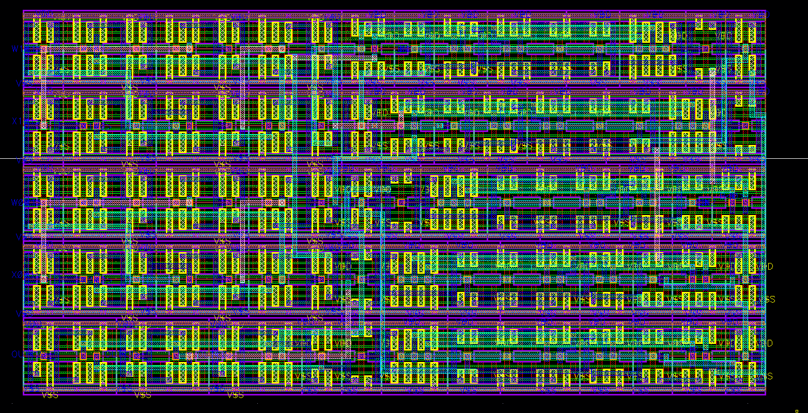
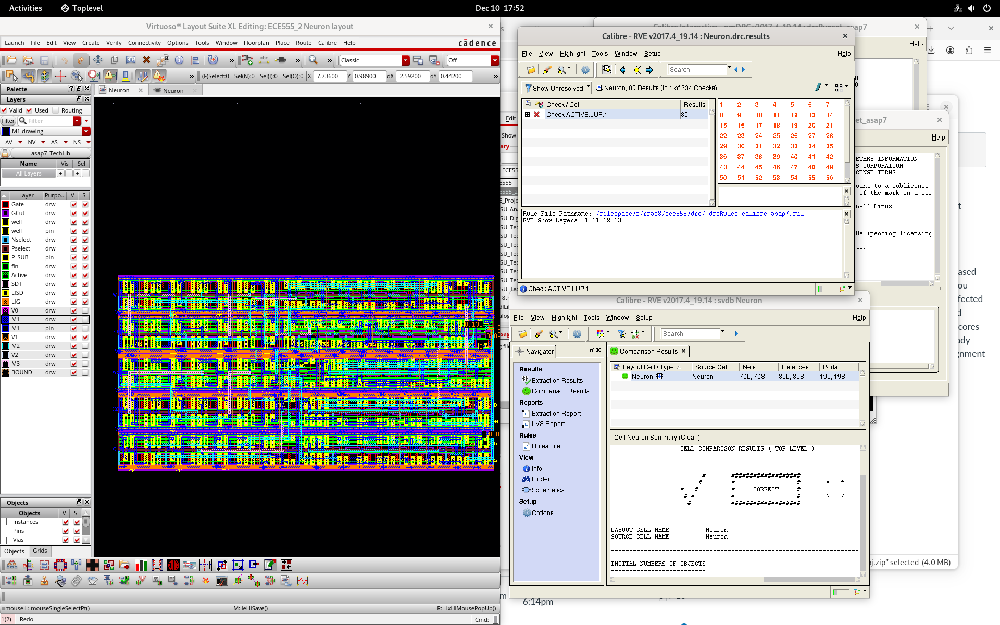
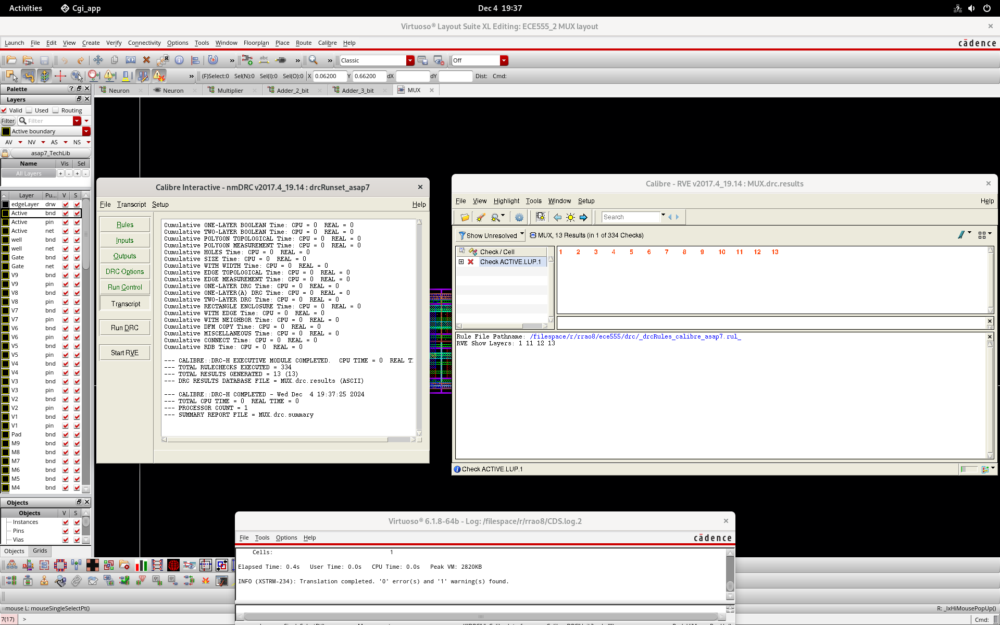
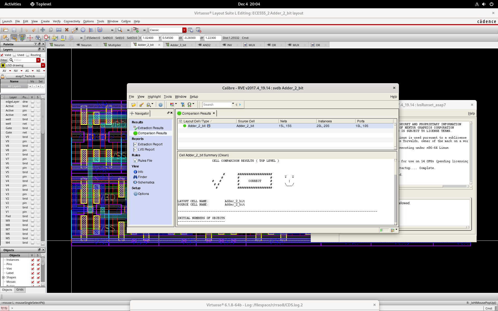
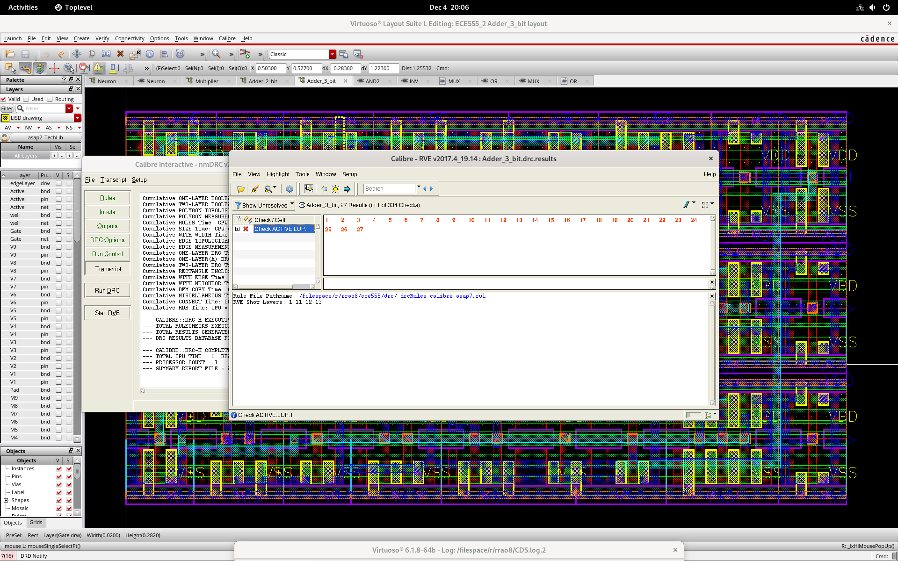

# MLP Neuron Cell Layout (Physical Design)

A neural network neuron implementation at the transistor level using Cadence Virtuoso and the ASAP 7nm FinFET PDK.

## Overview

This project implements the physical design (layout) of a neuron cell for a Multi-Layer Perceptron (MLP) neural network. The design includes gate-level submodules including multipliers, adders, and multiplexers, all built using FinFET transistors in ASAP 7nm technology.

## Key Results

| Metric | Improvement |
|--------|-------------|
| Area | 30% reduction |
| Power | 13% lower |
| Critical Path Delay | 10% reduction |
| Final Area | 4.75 µm² |
| Parasitic Capacitance | Reduced from 1.746e-16 F to 1.55e-16 F |

## Tools & Technology

- **EDA Tool**: Cadence Virtuoso
- **Process**: ASAP 7nm FinFET PDK
- **Verification**: Calibre DRC/LVS

## Design Architecture

The neuron consists of the following submodules:
- **Multiplier** - Handles weight × input computation
- **2-Bit Adders** - Intermediate summation
- **3-Bit Adders** - Final accumulation  
- **MUX** - Output selection

## Layout Optimization

### Before Optimization

The original layout had several inefficiencies:
- Long M2 and M3 metal routes
- Excessive M3 metal layer usage
- Poor floorplanning (non-rectangular shape)
- Critical path from Adder 3-bit to MUX spanning both M3 and M2 layers

### After Optimization

The optimized design features:
- Reduced metal layer usage
- Shortened route lengths
- Streamlined critical paths
- Rectangular floorplan for better area utilization

## Verification

### DRC and LVS Results

All submodules and the top-level neuron pass DRC (Design Rule Check) and LVS (Layout vs. Schematic) verification.

### Parasitic Extraction

## Submodule Verification

### MUX

### Multiplier

### 2-Bit Adders

### 3-Bit Adders

